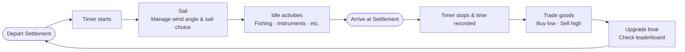

# Sailio — Game Overview

## Vision

Sailio is a sailing and exploration game about the quiet joy of being on the water. Players captain a small sailboat across a hand-crafted sea dotted with settlements, trading goods and upgrading their vessel between voyages. Every departure starts a timer. Every arrival ends one. The world keeps a record of every crossing — because in sailing, any two boats on the same route are always, implicitly, racing.

The game is designed to be accessible, family-friendly, and charming. It should feel like a world you want to spend time in, whether you are hunting for a personal best on your favorite route or simply pottering between harbors with a hold full of cargo.

---

## Design Pillars

### 1. Sailing Feels Real Enough to Respect
Wind direction matters. Sail choice matters. Players who have sailed will recognize the decision-making — when to tack, when to bear away, when to pop the spinnaker — even though the simulation is deliberately simplified. The game earns the respect of sailors without demanding sailing knowledge from everyone else.

### 2. Every Voyage Is a Race (Even Casual Ones)
A timer begins the moment a boat leaves a settlement and ends when it arrives at another. These times are recorded, ranked, and persistent. Players are never required to race — but their times are always being kept. A casual player making a trade run on a windy afternoon might, without trying, set a record that stands for weeks.

### 3. Cargo Does Not Cost You Speed
There is no mechanical incentive to sail without cargo. Boat speed is entirely a function of sail configuration, wind angle, and upgrades — carrying a full hold is identical in speed to sailing empty. This means trade runs and racing runs are the same run. Leaderboard times are not reserved for min-maxers.

### 4. The World Is Small and Knowable
The prototype world has 4–5 settlements, each 5–10 minutes apart by sail. Players should be able to learn the whole map quickly, develop preferences for certain routes, and feel a sense of ownership over the world. Scale is kept deliberately small so that every settlement feels distinct and visited, not anonymous.

### 5. Idle Time Is Earned, Not Wasted
Time on the water between ports is gameplay. Fishing, playing an instrument, and other modular idle activities give players something to do during longer passages. These activities are self-contained and expandable — they exist to make the voyage feel alive, not to add grind.

### 6. Cute, Tidy, and Family Friendly
The visual tone is clean, cartoonish, and warm. The world should feel inviting and a little playful. An animal-based character theme is under consideration for a future pass but is not committed to in the prototype. Nothing in the design should rely on a specific character aesthetic — placeholder models and a solid mechanical foundation come first.

---

## Core Loop

---

## Progression

Players earn money through trading — buying goods cheaply at one settlement and selling them at a premium elsewhere. Money funds boat upgrades across six categories:

| Upgrade | Applies to | Effect |
|---|---|---|
| Headsail | Jib, Genoa | Upwind and reaching speed |
| Mainsail | Jib, Genoa, Spinnaker | Speed in all configurations |
| Spinnaker | Spinnaker | Downwind speed |
| Hull | All | Reduced drag (universal speed) |
| Weight Reduction | All | Reduced drag (universal speed) |
| Cargo Capacity | — | Larger trading capacity |

The prototype includes one upgrade tier per category. The full game targets three or four tiers each. Speed upgrades apply equally regardless of cargo load. Each upgrade only applies to the sail configurations where that sail is flying — a Spinnaker upgrade has no effect on upwind speed, and a Headsail upgrade has no effect when running downwind.

Boat speed per configuration is calculated as:

> **Jib:** `speed = (headsail × mainsail × hull × weight_reduction) × f(jib, θ)`
> **Genoa:** `speed = (headsail × mainsail × hull × weight_reduction) × f(genoa, θ)`
> **Spinnaker:** `speed = (mainsail × spinnaker × hull × weight_reduction) × f(spinnaker, θ)`

---

## Racing System

- A timer starts automatically when a boat departs a settlement.
- The timer stops and is recorded when the boat arrives at any other settlement.
- Times are stored per route (origin → destination) and ranked.
- Multi-stop routes (up to 3 legs) are also tracked as combined times.
- Records are reset on a regular interval (target: monthly).
- In the prototype, records are local only. Future versions will support async online leaderboards and ghost-boat replays of recorded voyages.

---

## Tone & Aesthetic

- **Family friendly.** No violence, no dark themes. Suitable for all ages.
- **Cartoonish and clean.** Simple geometry, bold shapes, readable silhouettes.
- **Warm color palette.** Sunny water, bright sails, cheerful harbors.
- **Assets:** Built in Blender (3D models) and Inkscape (2D/UI). Placeholder models are used throughout the prototype.
- **Animal character theme:** Under consideration for a future pass. Not required for prototype. All systems should be character-agnostic.

---

## Technology

| | |
|---|---|
| **Engine** | Godot 4 |
| **Language** | GDScript |
| **Rendering** | 3D with a fixed camera angle (isometric-style) |
| **Map** | Hand-built; may be based on a real lake geometry (shapefile import) |
| **Platform** | itch.io |

The prototype is built as a 3D game from day one. This means the prototype is the foundation — visual and mechanical polish is layered on top of the same codebase rather than requiring a rebuild.

---

## Scope Philosophy

The prototype (v0.1) proves the core loop: sail, trade, time, rank. Everything else is future work. When in doubt about whether a feature belongs in the prototype, the answer is no. See [prototype/scope.md](../prototype/scope.md) for the explicit feature list.

